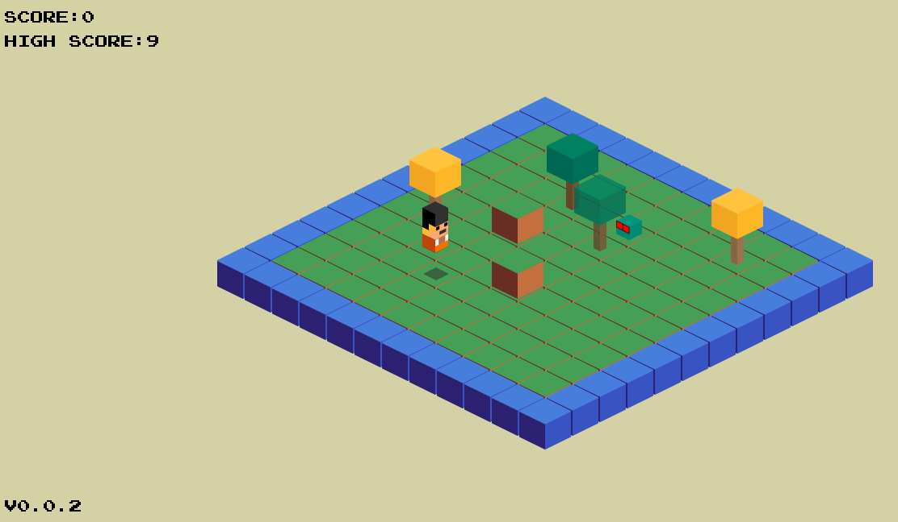

Snakr
=====
Snakr is a *Snake* **clone** with a small twist.

**WARNING: THIS IS NOT PRODUCTION QUALITY CODE.**

**Powered by [Fz2D](https://github.com/icebreaker/fz2d).**

Contribute
----------
* Fork the project.
* Make your feature addition or bug fix.
* Do **not** bump the version number.
* Send me a pull request. Bonus points for topic branches.

Credits
-------
* [Press Start 2P](http://www.fontspace.com/codeman38/press-start-2p)
* [SfMaker](http://www.leshylabs.com/apps/sfMaker/)

License
-------
Copyright (c) 2015, Mihail Szabolcs

Snakr is provided **as-is** under the **MIT** license. 
For more information see LICENSE.
